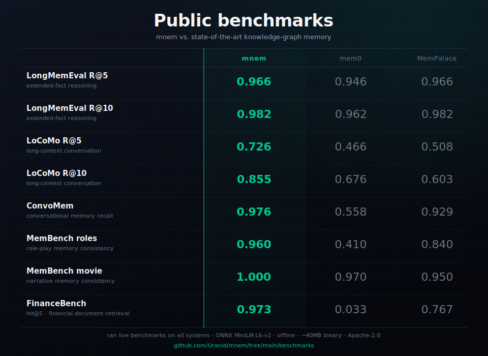
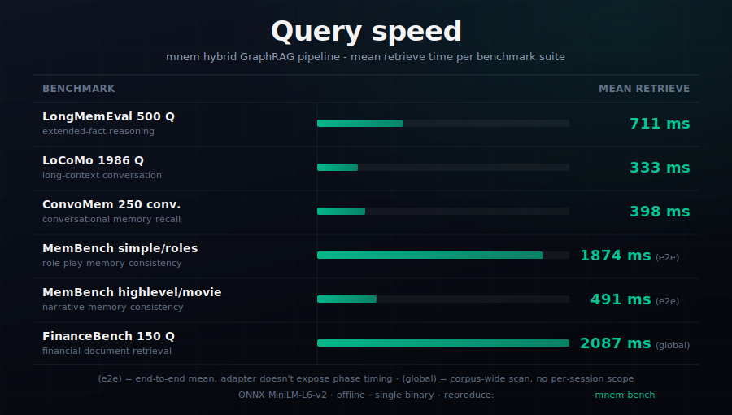

<div align="center">


[](LICENSE)
[](https://github.com/Uranid/mnem/actions/workflows/ci.yml)
[](https://crates.io/crates/mnem-cli)
[](https://pypi.org/project/mnem-cli/)
[](https://www.npmjs.com/package/mnem-cli)
[](rust-toolchain.toml)
[](#instalación)

</div>

<div align="center">

[English](README.md) &nbsp;·&nbsp; [中文](README.zh-CN.md) &nbsp;·&nbsp; [Español](README.es.md)

</div>

<hr>

**mnem es Git para el conocimiento de agentes de IA.** Una capa de conocimiento persistente y versionada para agentes de IA, con la mejor o igual recuperación en todos los benchmarks públicos que probamos.

Suelta código fuente, PDFs, documentos Markdown, exportaciones de conversación o directorios enteros, y mnem los analiza, los fragmenta y los indexa con un solo comando. El tipo de archivo se autodetecta: fragmentación por encabezados para Markdown, análisis por función y por clase para código fuente en muchos lenguajes, extracción por ventana deslizante para PDFs. Sin llamada a LLM durante la ingestión, así que el mismo input siempre produce el mismo grafo; re-ingerir un archivo sin cambios es una operación nula.

Habilidades, decisiones y convenciones viven como nodos y aristas tipadas en un grafo de conocimiento consultable dentro del directorio `.mnem/` de tu proyecto. Haz commit junto a tu código y los agentes de cada compañero parten de la misma base; ramifica, compara, fusiona o revierte cualquier escritura igual que harías con el código fuente. El olvido es de primera clase: revoca un hecho y todas las rutas de recuperación lo filtran automáticamente, conservando el rastro de auditoría.

La recuperación fusiona búsqueda vectorial, búsqueda por palabras clave y recorrido de grafo en una sola pasada, e informa exactamente cuántos tokens se consumieron y qué se descartó al alcanzar el presupuesto; nada se trunca en silencio. La expansión opcional multi-hop del grafo enlaza respuestas a través de documentos conectados.

Un único binario, sin servidor, sin base de datos externa, totalmente offline; el mismo motor corre como CLI, servidor HTTP, servidor MCP o biblioteca de Python, e incluso en el navegador mediante WebAssembly. Conéctalo a Claude Code, Cursor, Gemini CLI o cualquier host MCP con un solo comando. Listo para usar sin configuración; cambia el proveedor de embeddings con una línea de configuración cuando superes el predeterminado.

<hr>

<div align="center">

https://github.com/user-attachments/assets/bd744a7e-8e89-4531-bd96-fdee0030c390

</div>

<hr>

1. [El problema](#el-problema)
2. [Benchmarks](#benchmarks)
3. [vs otros](#comparación-con-otros)
4. [Instalación](#instalación)
5. [Inicio rápido](#inicio-rápido)
6. [Integrar / Desintegrar](#mnem-integrate---integrar-en-cualquier-host-de-agente)
7. [Comandos](#comandos)
8. [Herramientas MCP](#herramientas-mcp)
9. [API de Python](#api-de-python-mnem-py)
10. [GraphRAG](#graphrag)
11. [Qué obtienes](#qué-obtienes)
12. [Cuándo NO usar](#cuándo-no-usar-mnem)
13. [Documentación](#documentación)
14. [Contribuir](#contribuir)

<hr>

## El problema

> **A quién afecta esto:** Si usas asistentes de IA para programar (Claude Code, Cursor, Gemini CLI, etc.) o construyes software donde un agente de IA necesita recordar cosas entre sesiones, este es el problema que resuelve mnem.

> **Cada sesión empieza desde cero.**

- **Las sesiones están aisladas.** Planifica una migración en Claude Code (un asistente de IA para programar). Abre Cursor (otro asistente de IA) mañana. Ese agente nunca ha oído hablar de ella.
- **La memoria que no puedes inspeccionar no es memoria.** Algo cambió en el contexto de tu agente. No sabes qué, cuándo ni por qué. No hay registro.
- **Las convenciones se pudren en archivos planos.** Seis ingenieros, seis archivos `AGENTS.md` (archivos de configuración que muchas herramientas de IA leen automáticamente) divergiendo en silencio. Sin fusión, sin historial, sin forma de saber cuál es el actual.

> Tu código tiene git. El conocimiento de tu agente no.

<hr>

## Benchmarks

**Medido cara a cara contra mem0 y MemPalace en seis conjuntos de datos públicos. mnem lidera en cinco‡†; empata con MemPalace en LongMemEval.**

<div align="center"></div>

<details>
<summary><b>Metodología, notas al pie, velocidad de consulta y pasos de reproducción</b></summary>

> **Metodología:** Los números de mem0 son nuestra propia reproducción bajo el mismo harness - mem0 no publica puntuaciones R@K (Recall at top K - la fracción de respuestas correctas devueltas en los top K resultados) para estos conjuntos de datos. Los números de MemPalace se verificaron de forma cruzada bajo nuestro harness. Esto se revela, no se oculta: los artefactos reproducibles se publican junto al binario.

Embedder por defecto del harness: MiniLM-L6-v2 (un modelo de texto preentrenado pequeño en formato ONNX - ONNX es un formato abierto de archivo para modelos de IA; no necesitas instalar nada por separado), los mismos bytes en todos los sistemas de cada prueba. FinanceBench usa bge-large en todos los sistemas para una comparación justa (ver nota †). Sin reranking con LLM. Conteos de muestra por ejecución: LongMemEval 500 Q, LoCoMo conjunto completo (~1986 Q), ConvoMem 50/categoría, MemBench 100/configuración. Todos los benchmarks usan recuperación solo densa (sin canal disperso/BM25). Reproducir: `bash benchmarks/harness/run_bench.sh`.

<sup>Columnas de mem0: nuestra reproducción bajo el mismo harness (mem0 no publica titulares R@K en estos conjuntos de datos). Columnas de MemPalace: números de titulares públicos verificados cruzadamente bajo nuestro harness. Artefactos brutos: [`benchmarks/results/v0.1.0/`](benchmarks/results/v0.1.0/). † FinanceBench usa Ollama bge-large (1024 dimensiones) en todos los sistemas; MemPalace se muestra en la mejor configuración (bge-large con ChromaDB directo); mem0 aplica extracción de memoria con LLM antes del almacenamiento. Nota de pipeline: la ejecución de mnem en FinanceBench usó recuperación híbrida (`--hybrid-boost --query-expand`); MemPalace con bge-large usó recuperación vectorial pura - los pipelines difieren. Metodología completa: [`benchmarks/results/analysis/financebench.md`](benchmarks/results/analysis/financebench.md). ‡ LoCoMo: mnem usa puntuación de sesión MAX-over-turn-hits (permisiva); MemPalace usa agregación por turno (más estricta) - las puntuaciones reflejan metodologías de evaluación diferentes. Ver [`benchmarks/results/analysis/locomo.md`](benchmarks/results/analysis/locomo.md).</sup>

### Velocidad de consulta

<div align="center"></div>

<details>
<summary><b>Reproducir</b></summary>

```bash
mnem bench fetch longmemeval     # descargar conjuntos de datos (una vez, 264 MB)
mnem bench                       # TUI; seleccionar benchmarks de forma interactiva
mnem bench run --benches longmemeval --limit 50 --non-interactive
mnem bench results ./bench-out   # re-renderizar resultados de una ejecución anterior

# Harness bash heredado (ruta canónica para los números de cabecera)
bash benchmarks/harness/run_bench.sh
```

Metodología, artefactos brutos, desglose por benchmark: [`benchmarks/`](benchmarks/) y [`docs/src/benchmarks/`](docs/src/benchmarks/).

</details>

</details>

<hr>

## Comparación con otros

<sup>✅ soporte completo &nbsp;·&nbsp; ~ parcial o limitado &nbsp;·&nbsp; ✗ no admitido &nbsp;·&nbsp; n/a no aplica &nbsp;·&nbsp; <strong>+</strong> ver nota al pie</sup>

|  | <br>**mnem** | <br>**mem0** | <br>**MemPalace** | <br>**Hermes** | <br>**Supermemory** | <br>**Graphiti** | <br>**Letta** | <br>**Cognee** |
|--|:--------:|:--------:|:-------------:|:------------:|:---------------:|:------------:|:---------:|:----------:|
| Local primero | ✅ | ~ | ✅ | ~ | ✗ | ✗ | ~ | ~ |
| Historial versionado | ✅ | ✗ | ✗ | ✗ | ✗ | ✗ | ~ | ✗ |
| Ramas y fusión | ✅ | ✗ | ✗ | ✗ | ✗ | ✗ | ✗ | ✗ |
| Direccionamiento por contenido <sup>**+**</sup> | ✅ | ✗ | ✗ | ✗ | ✗ | ✗ | ✗ | ✗ |
| WASM / edge | ✅ | ✗ | ✗ | ✗ | ✗ | ✗ | ✗ | ✗ |
| Ingestión sin API | ✅ | ~ | ✅ | ~ | ✗ | ✗ | ✗ | ~ |
| Transparencia de presupuesto de tokens | ✅ | ✗ | ✗ | ~ | ✗ | ✗ | ~ | ✗ |
| Binario único | ✅ | ✗ | ✗ | ✗ | n/a | ✗ | ✗ | ✗ |
| Sin BD externa | ✅ | ~ | ✗ | ✅ | n/a | ✗ | ✗ | ~ |
| Grafo de conocimiento | ✅ | ✗ | ~ | ✗ | ✗ | ✅ | ✗ | ✅ |
| Recuperación híbrida | ✅ | ~ | ~ | ✗ | ~ | ✅ | ~ | ~ |
| MCP nativo | ✅ | ~ | ✅ | ✗ | ✅ | ~ | ✅ | ✅ |
| Licencia | Apache-2.0 | Apache-2.0 | MIT | MIT | MIT | Apache-2.0 | Apache-2.0 | Apache-2.0 |

<details>
<summary>Notas al pie y comparaciones detalladas</summary>

<sup><strong>+</strong> Direccionamiento por contenido: los mismos bytes siempre obtienen el mismo ID; los hechos idénticos se deduplican automáticamente &nbsp;·&nbsp; **Recuperación híbrida** aquí significa vector + dispersa + grafo en una sola pasada &nbsp;·&nbsp; **Hermes** es un runtime de agente, no un almacén de memoria; mnem se conecta como plugin `MemoryProvider` y las filas reflejan solo la memoria nativa de Hermes (`MEMORY.md` acotada + registro de sesión FTS5) &nbsp;·&nbsp; **mem0** v2 (abril 2026) eliminó los backends de grafo del SDK OSS &nbsp;·&nbsp; **Graphiti** requiere clave LLM + backend de grafo (Neo4j / FalkorDB / Kuzu / Neptune); incluye servidor MCP &nbsp;·&nbsp; **Letta** "MCP" = cliente MCP (los agentes Letta *llaman* a servidores MCP) &nbsp;·&nbsp; **MemPalace** usa ChromaDB por defecto (backend modular) &nbsp;·&nbsp; **Supermemory** self-host requiere Cloudflare + Postgres + OpenAI &nbsp;·&nbsp; **Cognee** requiere clave LLM para extracción de grafos; servidor MCP de primera parte desde v0.3.5 &nbsp;·&nbsp; verificado 2026-05-19</sup>

Análisis en profundidad:

- [mnem vs mem0](docs/src/comparisons/mem0.md) - capa de memoria para agentes, líder en OSS
- [mnem vs MemPalace](docs/src/comparisons/mempalace.md) - par metodológico en benchmarks
- [mnem vs Hermes](docs/src/comparisons/hermes.md) - runtime de agente; mnem se conecta como capa de memoria
- [mnem vs Supermemory](docs/src/comparisons/supermemory.md) - servicio de memoria alojado en la nube
- [mnem vs Graphiti](docs/src/comparisons/graphify.md) - herramienta de grafo de conocimiento para asistentes de IA
- [mnem vs Letta](docs/src/comparisons/letta.md) - framework de memoria para agentes (antes MemGPT)
- [mnem vs Cognee](docs/src/comparisons/cognee.md) - alternativa de KG para agentes

Matriz completa: [`docs/src/comparisons/README.md`](docs/src/comparisons/README.md).

</details>

<hr>

## Instalación

**Elige una** (pip es la opción recomendada si tienes Python):

**pip (Python) - recomendado** · binario precompilado, embedder incluido, funciona de inmediato

<details>
<summary>¿Aún no tienes pip?</summary>

[Instala Python](https://www.python.org/downloads/) (gratuito; pip viene incluido con Python 3.4+). Verifícalo con `python --version`.

</details>

```bash
pip install mnem-cli
```

> **¿Usas Python para llamar a mnem desde tu propia app?** `pip install mnem-cli` te da el comando `mnem` en la línea de comandos. Para importar mnem desde código Python (`import pymnem`), usa `pip install mnem-py` en su lugar - ver [API de Python](#api-de-python-mnem-py).

**npm (Node.js)** · binario precompilado, embedder incluido, funciona de inmediato

<details>
<summary>¿Aún no tienes npm?</summary>

[Instala Node.js](https://nodejs.org/en/download) (gratuito; npm viene incluido, se requiere Node 18+). Verifícalo con `node --version`.

</details>

```bash
npm install -g mnem-cli
```

**Cargo (Rust)** · compila desde el código fuente, ~5-15 min la primera vez

<details>
<summary>¿Aún no tienes Cargo?</summary>

[Instala mediante rustup](https://rustup.rs/) (gratuito; también instala `rustc`). Verifícalo con `cargo --version`.

</details>

```bash
# Solo Linux: sudo apt-get install g++ (Debian/Ubuntu/WSL)  o  sudo dnf install gcc-c++ (Fedora/RHEL)
cargo install --locked mnem-cli --features bundled-embedder
```

<details>
<summary>Sáltate la compilación (<code>cargo binstall</code>)</summary>

`cargo install` compila desde el código fuente (los ~5-15 min de arriba). Si prefieres el mismo binario precompilado que usan pip y npm, instala [cargo-binstall](https://github.com/cargo-bins/cargo-binstall) una vez y luego:

```bash
cargo binstall mnem-cli
```

Descarga el archivo del release de GitHub en segundos. Mismos bytes, mismas features (`bundled-embedder` ya incluido). Usa `cargo install` solo cuando necesites un set de features personalizado (p. ej. `--features bundled-embedder-cuda`).

</details>

**Desde el código fuente** · la rama `main` sin publicar, para cambios locales o commits previos a una release

<details>
<summary>Cuándo elegir esto en lugar de <code>cargo install</code></summary>

Úsalo si necesitas un commit que aún no se ha publicado en crates.io, o si estás haciendo cambios locales. De lo contrario, prefiere la ruta del crate publicado de arriba. Requiere Rust 1.95+ (`rustup install 1.95 && rustup default 1.95` si es necesario).

</details>

```bash
# Solo Linux: sudo apt-get install g++ (Debian/Ubuntu/WSL)  o  sudo dnf install gcc-c++ (Fedora/RHEL)
git clone https://github.com/Uranid/mnem
cd mnem
cargo install --path crates/mnem-cli --features bundled-embedder
```

**Docker** · ejecuta el servidor HTTP; no requiere instalación local

```bash
docker run --rm -p 9876:9876 -e MNEM_HTTP_ALLOW_NON_LOOPBACK=1 \
  ghcr.io/uranid/mnem:latest http --bind 0.0.0.0:9876
```

```bash
mnem --version    # confirmar instalación
mnem doctor       # verifica el embedder + almacenamiento + configuración; imprime una lista con marcadores verde/amarillo/rojo
```

> **Si aparece `mnem: command not found`:** Primero intenta abrir una nueva terminal (los cambios de PATH solo tienen efecto en sesiones nuevas). En Linux, pip instala en `~/.local/bin` - si eso no está en tu PATH, ejecuta `export PATH="$HOME/.local/bin:$PATH"` y luego añade esa misma línea a `~/.bashrc` (es una corrección de una sola vez; el cambio en el archivo lo hace permanente). En Windows: 1. Ejecuta `pip show mnem-cli`. 2. Copia el valor de `Location` (p. ej. `C:\Users\tu_usuario\AppData\Roaming\Python\Python312\site-packages`). 3. Reemplaza `site-packages` con `Scripts` para obtener la ruta a la carpeta Scripts. 4. Abre Propiedades del sistema -> Variables de entorno -> Path -> Editar -> Nuevo -> pega la ruta de Scripts -> Aceptar. 5. Abre un nuevo Símbolo del sistema - los cambios de PATH requieren una ventana nueva para tener efecto.

> [!NOTE]
> `--locked` fija las versiones exactas de dependencias probadas. `--features bundled-embedder` empaqueta el embedder (~40 MB) en el binario para que `mnem retrieve` funcione de inmediato sin configuración adicional. **Este flag es exclusivo de Cargo**; pip y npm ya incluyen el embedder. Sin él (y sin configurar otro proveedor en `config.toml`), `mnem retrieve` falla con "embedder not configured".

Matriz de instalación completa: [`docs/src/install.md`](docs/src/install.md).

> **¿Integrando mnem dentro de una aplicación Python?** El `pip install mnem-cli` anterior instala el **binario CLI** como una wheel. La **API nativa de Python** (`import pymnem`) se encuentra en un paquete separado. Ve a **[API de Python (mnem-py) ↓](#api-de-python-mnem-py)** para `pip install mnem-py` y ejemplos de uso.

<hr>

## Inicio rápido

**Paso 1: Pruébalo ahora (independiente, sin asistente de IA necesario)**

```bash
mkdir my-graph
cd my-graph
mnem init          # obligatorio una vez por proyecto - crea la carpeta .mnem/ que almacena tu grafo
mnem ingest --text "mnem is a versioned knowledge graph for AI agents"
mnem retrieve "what does mnem do"
```

> `mnem init` es necesario una vez por proyecto antes de `mnem ingest` o `mnem retrieve` - crea la carpeta `.mnem/`. Si algo parece incorrecto, ejecuta `mnem doctor`.

Salida esperada:
```
[1] score=0.94  mnem is a versioned knowledge graph for AI agents
    tokens_used=12  candidates_seen=1  dropped=0
```

**Paso 2 (opcional): Conecta tu asistente de IA**

> **Requisito previo:** Este ejemplo usa Claude Code. ¿No lo tienes? Descárgalo gratis en [claude.ai/code](https://claude.ai/code). ¿Sin agente? Salta a la "Sesión 2" - `mnem retrieve` funciona de forma independiente.

> **Directorio de trabajo:** Abre Claude Code desde `my-graph/` (o un subdirectorio) después de conectarlo - si lo lanzas desde una carpeta diferente, no encontrará este grafo.

```bash
# Sesión 1: añadir un hecho y conectar el agente
mnem init     # omitir si ya ejecutaste esto en el Paso 1
mnem ingest --text "The API retry policy uses exponential backoff with a 3-attempt limit"
mnem integrate claude-code    # Cursor: usa `mnem integrate cursor`

# Sesión 2 (al día siguiente, nueva terminal): la memoria persiste
cd my-graph
mnem retrieve "what is our API retry policy"
```

Después de `mnem integrate`, cierra y vuelve a abrir la aplicación (no solo el terminal). Para verificar: abre cualquier sesión y envía un mensaje - deberías ver `mnem: N item(s)` antes de que Claude responda. `0 item(s)` significa que el grafo está vacío pero la integración está funcionando.

> **Grafo local vs global:** `.mnem/` en el directorio de tu proyecto almacena la memoria específica del proyecto. `~/.mnemglobal/.mnem/` (el grafo global, donde `~` es tu directorio home - p. ej. `C:\Users\tu_usuario` en Windows, `/home/tu_usuario` en Linux/macOS) almacena hechos que abarcan todos tus proyectos - preferencias personales, convenciones compartidas del equipo, entidades entre repositorios. Usa `mnem global retrieve` y `mnem global add` para acceder a él.

**Próximos pasos:**
- Ingiere un archivo: `mnem ingest README.md` (o `mnem ingest tus-docs/ --recursive` para un directorio completo)
- Conecta tu asistente de IA: `mnem integrate` (Claude Code, Cursor y más)
- Pregunta lo que quieras: `mnem retrieve "tu pregunta"`

Cinco minutos desde cero. Consulta [`docs/src/quickstart.md`](docs/src/quickstart.md) para el recorrido completo.

<hr>

## `mnem integrate` - integrar en cualquier host de agente

> **¿No usas Claude Code, Cursor u otro asistente de IA para programar?** Omite esta sección - `mnem integrate` solo es necesario si quieres que una de esas herramientas use mnem automáticamente.

> **Claude Code, Cursor y herramientas similares deben estar ya instaladas.** `mnem integrate` detecta cuáles están presentes - ejecuta primero `mnem integrate --check` para ver qué se detecta.

Un solo comando conecta mnem con tu host de agente. Para los hosts compatibles con MCP añade el **servidor MCP** (herramientas como `mnem_retrieve` y `mnem_commit`), un **disparador de recuperación automática** allí donde el host admite hooks, y el **prompt de sistema de mnem** allí donde el host tiene un archivo de reglas. Hermes Agent es solo-hooks por diseño: `mnem integrate hermes` escribe hooks `pre_llm_call` / `post_llm_call` de Hermes que añaden la memoria recuperada como una capa adicional de contexto y persisten el turno, sin modificar el prompt de sistema de Hermes. Reinicia el host (cierra y vuelve a abrir Claude Code, Cursor, Hermes, etc. como aplicación, no solo el terminal) y el agente empieza a usar mnem automáticamente. Para verificar: inicia una nueva sesión y envía cualquier mensaje - deberías ver el contexto de mnem recuperado inyectado antes de que el modelo responda. `0 item(s)` está bien - significa que el grafo está vacío; la integración está funcionando.

> **Solución de problemas:** ¿No ves `mnem: N item(s)`?
> - Asegúrate de haber cerrado y vuelto a abrir la **aplicación** (no solo el terminal) - esto significa cerrar completamente la ventana de Claude Code o Cursor y volver a lanzarla
> - Abre la aplicación desde dentro del directorio que contiene tu carpeta `.mnem/` (o cualquier subdirectorio) - si abres Claude Code desde una carpeta diferente, no encontrará el grafo de ese proyecto
> - Ejecuta `mnem doctor` para comprobar que el embedder y el almacén están sanos
> - Ejecuta `mnem integrate --check` para ver si el host fue conectado correctamente

```bash
mnem integrate                           # interactivo: detecta hosts instalados y pregunta
mnem integrate claude-code               # conecta un host específico, omite la detección interactiva
mnem integrate hermes                    # conecta solo los hooks pre/post LLM de Hermes
mnem integrate --all                     # conecta todos los hosts detectados sin preguntar

mnem integrate --check                   # muestra el estado de conexión de todos los hosts; no cambia nada
mnem integrate --dry-run                 # previsualiza lo que se escribiría sin cambiar nada
mnem integrate --show claude-code        # imprime el bloque JSON del MCP para copiar y pegar manualmente

mnem integrate --no-hooks                # omite la conexión del hook UserPromptSubmit
mnem integrate --no-system-prompt        # omite la conexión del prompt de sistema
mnem integrate --target-repo ~/notes     # apunta el servidor MCP a un grafo específico, no al global
```

**Qué se conecta:**
- **Servidor MCP** (`mcpServers.mnem`) - los hosts compatibles con MCP obtienen acceso completo a las herramientas de mnem mediante `mnem mcp --repo <graph>`; por defecto apunta al grafo global (`~/.mnemglobal/.mnem`)
- **Disparador de recuperación automática** - Claude Code obtiene un hook `UserPromptSubmit`; Hermes Agent obtiene hooks shell `pre_llm_call` / `post_llm_call` en `$HERMES_HOME/config.yaml` (por defecto `~/.hermes/config.yaml` cuando `$HERMES_HOME` no está definido). Ambos consultan primero el grafo local y luego recurren al global.
- **Prompt de sistema** - instrucciones de uso de mnem inyectadas en los hosts con archivos de reglas. Hermes está deliberadamente excluido porque su contrato de hooks está diseñado para enriquecer el contexto del usuario con una capa adicional en lugar de modificar el prompt de sistema.

El hook consulta primero el directorio `.mnem/` de tu proyecto (recorriendo hacia arriba desde el directorio actual) y luego recurre automáticamente a `mnem global retrieve`. El hook y el prompt de sistema se comportan igual independientemente del grafo de conocimiento predeterminado que elijas durante la configuración. Usa `--target-repo` solo si quieres que el servidor MCP apunte a un lugar distinto del grafo global.

Detecta y configura automáticamente:
- Claude Code
- Claude Desktop
- Cursor
- Continue
- Zed
- Gemini CLI
- Hermes Agent

Cualquier otro host compatible con MCP funciona mediante una entrada `mcpServers` editada manualmente que apunte a `mnem mcp --repo <path>` - consulta [`docs/src/mcp.md`](docs/src/mcp.md).

El agente obtiene el conjunto completo de herramientas de mnem como herramientas nativas: recuperar, confirmar, ingerir, tombstone, recorrer, acceso al grafo global y más. Sin daemon adicional, sin puertos que gestionar. Referencia completa de herramientas: [`docs/src/mcp.md`](docs/src/mcp.md).

<details>
<summary>Eliminar mnem de un host</summary>

```bash
mnem unintegrate                  # interactivo: elegir de qué hosts eliminar mnem
mnem unintegrate claude-code      # eliminar un host
mnem unintegrate --all            # eliminar todos los hosts conectados
```

Ejecuta `mnem unintegrate --help` para ver todas las opciones.

</details>

<hr>

## Comandos

> **Glosario rápido:** **nodo** = una entrada individual en el grafo (un hecho, fragmento de documento o entidad - cualquier cosa que almacenes). **arista** = un enlace tipado entre dos nodos (`depends_on`, `relates_to`, `part_of`, etc.). **CID** = ID con direccionamiento por contenido - una huella digital única basada en bytes exactos; cada nodo, arista y commit obtiene uno. **HEAD** = el extremo del op-log actual (commit más reciente - mismo concepto que en git). **op-log** = el registro de solo adición de todas las operaciones de escritura. **ref** = un puntero con nombre a un CID de commit (p. ej. `refs/heads/main` - igual que una rama o etiqueta de git).

Cada comando acepta `--help` para la referencia completa de flags. Referencia completa de la CLI: [`docs/src/cli.md`](docs/src/cli.md).

---

### 1. `mnem init` - Inicializar un grafo de conocimiento

Crea un almacén `.mnem/` en el directorio actual. Haz commit de él junto a tu codebase para que cada desarrollador y agente parta de la misma base.

```bash
mnem init
```

> **Ejemplo:** Tu equipo despliega un agente de IA junto a un servicio API. Ejecuta `mnem init` una vez en la raíz del repositorio - cada ingeniero que clone el repositorio obtiene la misma base de conocimiento en la que se entrenaron sus agentes.

<details>
<summary>Comprobación de salud y diagnóstico</summary>

```bash
mnem doctor    # comprueba embedder, almacén, configuración - lista con marcadores verde/amarillo/rojo
mnem stats     # nodos, aristas, refs, tamaño del almacén de un vistazo
```

</details>

---

### 2. `mnem ingest` - Añadir documentos al grafo

Analiza un archivo o directorio en nodos `Doc`, `Chunk` y `Entity` en un solo paso. Sin LLM en la ingestión - determinista y apto para auditorías: los mismos bytes siempre producen los mismos CIDs (IDs con direccionamiento por contenido - una huella digital única calculada automáticamente a partir de los bytes del contenido; cada nodo, arista y commit obtiene uno).

```bash
mnem ingest architecture.md
mnem ingest --recursive docs/               # ingerir un directorio completo
```

El tipo de archivo se detecta automáticamente por extensión: Markdown usa fragmentación consciente de encabezados, el código fuente (`.rs`, `.py`, `.ts`, `.go` y más) usa análisis de función/clase con Tree-sitter, los PDFs usan extracción de texto con ventana deslizante - todo se gestiona automáticamente sin flags adicionales.

> **Ejemplo:** Un agente que se incorpora a tu plataforma ingiere `ARCHITECTURE.md`, el directorio `runbooks/` y todos los archivos ADR al arrancar. Cada agente posterior recupera el mismo conocimiento estructurado sin volver a leer cada archivo desde cero.

<details>
<summary>Más opciones</summary>

```bash
mnem ingest --text "Deploy window is Tuesdays 10-11 AM UTC"  # ingerir texto en línea sin un archivo
mnem ingest src/ --recursive                # ingerir todos los archivos fuente bajo src/
mnem ingest --chunker recursive report.pdf  # PDF con fragmentación recursiva explícita
mnem ingest --extractor keybert notes.md    # enriquecimiento de frases clave para recuperación dispersa más potente
mnem ingest --max-tokens 256 notes.md       # fragmentos más pequeños para recuperación más granular
```

</details>

---

### 3. `mnem add` - Escribir hechos y relaciones individuales

Confirma un único nodo de hecho, o conecta dos entidades con una arista tipada. El primitivo de escritura de más bajo nivel - úsalo cuando quieras un control preciso sobre lo que entra en el grafo. La etiqueta opcional `--label` (p. ej. `Fact`, `Convention`, `Decision`) categoriza los nodos para que puedas filtrar la recuperación por tipo más adelante.

```bash
mnem add node -s "Deploy window is Tuesdays 10-11 AM UTC"
```

> **Ejemplo:** A mitad de una conversación, un agente descubre una restricción no documentada. Confirma el hallazgo de inmediato para que cada agente posterior opere desde la misma verdad compartida - sin más redescubrimientos del mismo caso límite entre sesiones.

<details>
<summary>Más opciones de escritura</summary>

```bash
mnem add node --label Fact -s "The payments API uses idempotency keys for all POST requests"
mnem add node --label Convention -s "All REST APIs are versioned under /v1/"
mnem add edge --from <uuid> --to <uuid> --label depends_on        # conectar dos nodos existentes
```

</details>

<details>
<summary>Leer y eliminar nodos</summary>

```bash
mnem get <uuid>                                                    # obtener un nodo por UUID
mnem get <uuid> --content                                         # incluir el cuerpo de contenido completo

mnem tombstone <uuid>                                             # eliminación suave: oculto de la recuperación, conservado en el registro de auditoría
mnem tombstone <uuid> --reason "superseded by v2 decision"        # registrar el motivo
mnem delete <uuid>                                                # eliminación definitiva: sin registro de auditoría

mnem global get <uuid>                                            # buscar un nodo en el grafo global
mnem global tombstone <uuid>                                      # eliminación suave en el grafo global
```

</details>

---

### 4. `mnem retrieve` - Buscar en el grafo

Recuperación híbrida semántica + palabras clave + grafo en un solo paso. Devuelve exactamente lo que encontró, lo que omitió y cuántos tokens se utilizaron - sin truncación silenciosa al agotar el presupuesto de tokens.

```bash
mnem retrieve "what did we decide about the API rate-limit design"
```

> **Ejemplo:** Tres sprints después, un nuevo ingeniero pregunta al agente "¿por qué nuestra lógica de reintento es exponencial?" El agente recupera el nodo de decisión original con la justificación completa - sin que nadie tuviera que recordar documentarlo por separado.

<details>
<summary>Más opciones</summary>

```bash
mnem -R ~/notes retrieve "query"           # apuntar a un grafo específico explícitamente
mnem retrieve "..." --limit 20             # devolver más resultados
mnem retrieve "..." --graph-expand 20      # añadir recorrido de grafo multi-salto
mnem retrieve "..." --graph-expand 20 --community-filter --graph-mode ppr
mnem retrieve "..." --rerank cohere:rerank-english-v3.0
mnem retrieve "..." --vector-cap 512       # ampliar el grupo de candidatos denso
mnem retrieve "..." --explain              # imprimir puntuaciones de carril por elemento (vector, disperso, expansión de grafo, reordenación)
```

Consulta [GraphRAG](#graphrag) para la referencia completa de flags.

</details>

---

### 5. `mnem global` - Memoria entre proyectos y sesiones

Un segundo grafo en `~/.mnemglobal/.mnem/` (donde `~` es tu directorio home: `C:\Users\tu_usuario` en Windows, `/home/tu_usuario` en Linux/macOS) que sigue a los agentes a todas partes - entre repositorios, equipos y sesiones. Úsalo para convenciones compartidas, decisiones de proveedores y entidades que aparecen en cada proyecto.

```bash
mnem global retrieve "what payment provider do we use"
mnem global add node --label Convention -s "All REST APIs are versioned under /v1/"
```

> **Ejemplo:** Tu plataforma tiene una docena de microservicios, cada uno con su propio `.mnem/`. El grafo global almacena convenciones de todo el equipo, definiciones de entidades compartidas y decisiones entre servicios. Cualquier agente en cualquier servicio puede consultarlo sin saber en qué repositorio se originó el hecho.

<details>
<summary>Más opciones y orientación sobre local vs global</summary>

```bash
mnem global ingest contacts.md
mnem global add node --label Entity:Person \
  --prop name=Alice -s "Alice leads the infra team"
mnem global get <uuid>
mnem global tombstone <uuid>
```

**Cuándo usar local vs global:**

| Usa `.mnem/` local para | Usa `mnem global` para |
|------------------------|----------------------|
| Hechos, decisiones y contexto de código específicos del proyecto | Personas, preferencias y hechos que abarcan todos los proyectos |
| Memoria por repositorio que viaja con el repositorio | Conocimiento que quieres que vean todas las sesiones y todos los agentes |
| Todo lo que incluirías en un commit junto al código | Continuidad entre sesiones |

El comando `mnem integrate` configura el agente para leer primero el grafo local y recurrir automáticamente al global - no se requiere cambio manual durante el uso normal.

</details>

---

### 6. `mnem status` / `mnem log` - Inspeccionar el historial

Consulta el estado actual del grafo y recorre el op-log hacia atrás.

```bash
mnem status    # CID de op-head, commit actual, todas las refs nombradas, recuentos de etiquetas
mnem log       # recorre el op-log hacia atrás, últimas 20 entradas
```

<details>
<summary>Más opciones</summary>

```bash
mnem stats              # resumen compacto en una línea: CIDs, recuento de refs, nombres de etiquetas
mnem log -n 50          # mostrar las últimas 50 entradas
mnem log --oneline      # formato compacto de una línea por operación
mnem log --format json  # flujo JSON legible por máquina
```

</details>

---

### 7. `mnem diff` / `mnem show` - Comparar instantáneas e inspeccionar bloques

Ve exactamente qué cambió entre dos CIDs de operación: deltas de refs más diferencia estructural de nodos/aristas. Decodifica cualquier bloque por CID para un análisis forense detallado.

```bash
mnem log          # lista los commits con sus CIDs - copia un CID de aquí para usarlo abajo
mnem diff HEAD <cid>
```

> **Ejemplo:** Un agente ejecutó durante la noche y confirmó cientos de nuevos hechos. Antes de fusionarlos en `main`, un revisor compara `HEAD` con la instantánea anterior a la ejecución para confirmar que no se añadió ni eliminó nada inesperado.

<details>
<summary>Más opciones</summary>

```bash
mnem diff <op-a-cid> <op-b-cid>   # comparar cualquier dos operaciones

mnem show               # decodificar e imprimir de forma legible el bloque op-head actual
mnem show <cid>         # decodificar cualquier bloque por CID (Node, Edge, Commit, Operation, ...)

mnem cat-file <cid>                # emitir bytes DAG-CBOR en bruto de cualquier bloque a stdout
mnem cat-file <cid> --json         # decodificar a DAG-JSON e imprimir de forma legible (pipe a jq)
```

</details>

---

### 8. `mnem branch` - Crear y gestionar ramas

Ramifica el grafo de conocimiento de la misma forma que ramificas código. Cada rama es una línea independiente de commits - experimenta libremente y fusiona cuando estés listo.

```bash
mnem branch create agentic-workflow
```

> **Ejemplo:** Dos agentes están probando enfoques en competencia para un pipeline de resumen. Cada uno trabaja en su propia rama - `approach-a` y `approach-b` - confirmando hallazgos a medida que avanza. Un revisor fusiona la rama ganadora de vuelta en `main`, preservando el historial completo de ambos experimentos.

<details>
<summary>Más opciones</summary>

```bash
mnem branch list                        # listar todas las ramas; * marca la actual
mnem branch create <name> <start>       # crear rama desde una ref, nombre de rama o CID
mnem branch create <name> --from HEAD   # forma explícita --from; misma resolución que arriba
mnem branch delete <name>               # eliminar un puntero de rama local
```

</details>

---

### 9. `mnem merge` - Fusionar ramas

Fusión de grafo a 3 vías - el mismo modelo que `git merge`, pero para conocimiento. Los conflictos aparecen en `.mnem/MERGE_CONFLICTS.json` para una resolución explícita.

```bash
mnem merge agentic-workflow
```

> **Ejemplo:** El Agente A pasó una semana procesando entrevistas de clientes; el Agente B procesó tickets de soporte en paralelo. La fusión combina ambas bases de conocimiento de forma limpia - ningún hecho se sobrescribe silenciosamente y la procedencia completa de cada nodo se preserva.

<details>
<summary>Más opciones</summary>

```bash
mnem merge <branch> --strategy=ours     # resolución automática: conservar el lado actual
mnem merge <branch> --strategy=theirs   # resolución automática: tomar el lado entrante
mnem merge <branch> --dry-run           # previsualizar resultado sin persistir nada
mnem merge --continue                   # finalizar tras editar MERGE_CONFLICTS.json
mnem merge --abort                      # cancelar; restaurar HEAD desde ORIG_HEAD
```

</details>

---

### 10. `mnem push` / `mnem pull` / `mnem clone` - Sincronizar con un remoto

Sube y descarga un grafo de conocimiento de la misma forma que subes y descargas código. El formato de transferencia es el estándar CAR v1 (Content Addressed aRchive, un formato binario compatible con IPFS).

> **Antes de tu primer push**, registra un remoto: `mnem remote add origin <url>` donde `<url>` es la dirección de tu servidor - por ejemplo, `http://mi-servidor:9876` o `https://mnem.ejemplo.com` (consulta Más opciones a continuación para la lista completa de comandos de remoto).
>
> **¿Ejecutas tu propio servidor?** En la máquina destino, configura `MNEM_HTTP_ALLOW_NON_LOOPBACK=1` y ejecuta `mnem http --bind 0.0.0.0:9876`. El mismo binario que impulsa la CLI también sirve por HTTP - no se necesita instalación separada ni daemon. Luego `mnem remote add origin http://<ip-del-servidor>:9876` en el lado del cliente.
>
> **Autenticación (bearer token):** Por defecto, `mnem http` no tiene autenticación. Para asegurar push/pull, tanto el servidor como el cliente deben usar el mismo token:
> ```bash
> # Lado servidor: establece el token e inicia el servidor
> export MNEM_HTTP_AUTH_TOKEN=my-secret-token
> MNEM_HTTP_ALLOW_NON_LOOPBACK=1 mnem http --bind 0.0.0.0:9876
>
> # Lado cliente: registra el remoto apuntando a una variable de entorno con el mismo token
> export MNEM_REMOTE_ORIGIN_TOKEN=my-secret-token
> mnem remote add origin http://my-server:9876 --token-env MNEM_REMOTE_ORIGIN_TOKEN
> mnem push   # sale con código 1 y "authentication failed (HTTP 401)" si el token es incorrecto o falta
> ```
> El servidor rechaza las peticiones con un token incorrecto o ausente con HTTP 401. Nunca escribas el valor del token directamente en los comandos - usa variables de entorno. Si `MNEM_REMOTE_ORIGIN_TOKEN` no está definido o está vacío en el momento del push, `mnem push` sale con código 1 y "missing authentication token" antes de realizar ninguna petición de red.

```bash
mnem push          # enviar HEAD a origin/main
mnem pull          # avance rápido de origin/main hacia HEAD
```

> **Nota de escritor único:** `mnem push` y `mnem pull` adquieren el bloqueo de escritura en el almacén local. Si `mnem http` se está ejecutando contra el mismo almacén, el push se bloqueará hasta que el servidor libere cualquier escritura en curso (no corrompe datos, pero esperará). Si necesitas un push limpio sin esperar, detén `mnem http` primero. Para pipelines de CI concurrentes que escriben en el mismo remoto, usa una cola externa o repositorios separados fusionados con `mnem merge`.

> **Ejemplo:** Un agente ejecutándose en CI confirma nuevos hallazgos después de cada build y hace push. Los agentes en las máquinas de los desarrolladores hacen pull al inicio de sesión - todo el equipo trabaja desde la misma base de conocimiento sin ninguna sincronización manual.

<details>
<summary>Más opciones</summary>

```bash
mnem push <remote> <branch>             # enviar una rama específica
mnem pull <remote> <branch>             # recibir desde un remoto/rama específico

mnem fetch                              # obtener sin fusionar (remoto por defecto)
mnem fetch <remote>                     # obtener desde un remoto con nombre

mnem clone <url> [<dir>]                # clonar un archivo CAR en <dir>
mnem clone file:///tmp/repo.car ./copy  # clonar desde una ruta de archivo local
mnem clone ./repo.car ./copy            # forma corta de ruta (debe terminar en .car)

mnem remote add <name> <url>                         # registrar un remoto
mnem remote add <name> <url> \
  --token-env MNEM_REMOTE_ORIGIN_TOKEN               # suministrar el token bearer mediante variable de entorno
mnem remote list                                     # listar todos los remotos configurados
mnem remote show <name>                              # mostrar URL + capacidades
mnem remote remove <name>                            # eliminar una entrada de remoto
```

</details>

---

### 11. `mnem query` - Consultas estructuradas del grafo

Filtro de coincidencia exacta de propiedades con recorrido de aristas opcional. No se necesita cálculo de embeddings - rápido y determinista.

```bash
mnem query --where name=Alice
```

> **Ejemplo:** Un agente construye un organigrama a partir de documentos de incorporación. Más tarde, otro agente ejecuta `mnem query --where kind=Person --with-outgoing reports_to` para reconstruir la estructura completa de informes sin una búsqueda de texto.

<details>
<summary>Más opciones</summary>

```bash
mnem query --where kind=Person -n 25             # aumentar el límite de resultados
mnem query --where kind=Person \
  --with-outgoing knows                          # seguir aristas "knows" salientes
mnem query --where status=active \
  --with-outgoing depends_on \
  --with-outgoing depends_on                     # encadenar múltiples saltos

mnem blame <node-uuid>                           # listar todas las aristas entrantes a un nodo
mnem blame <node-uuid> --etype authored          # filtrar a un tipo de arista
mnem blame <node-uuid> --first-writer            # mostrar el commit ancestro más antiguo por arista (BFS)

# mnem ref: gestionar refs con nombre (ramas/etiquetas por CID)
mnem ref list                         # listar todas las refs (refs/heads/*, refs/remotes/*, ...)
mnem ref set <name> <target-cid>      # apuntar una ref a un CID de commit específico
mnem ref delete <name>                # eliminar una ref con nombre
```

</details>

---

### 12. `mnem reindex` - Gestionar embeddings

Rellena o actualiza los embeddings vectoriales para los nodos. Ejecuta esto después de añadir un nuevo proveedor de embeddings o cambiar de modelo.

> **¿Ejecutas `mnem reindex` mientras `mnem http` está activo?** `mnem reindex` es una operación de escritura - adquiere el bloqueo de escritura único, por lo que espera hasta que cualquier escritura en curso se complete antes de empezar. Las lecturas HTTP en curso (`mnem retrieve`) continúan funcionando durante el reindexado pero pueden ver embeddings desactualizados hasta que el commit de reindexado se aplique. Detén el servidor HTTP primero si necesitas una instantánea consistente en un punto específico del tiempo.

```bash
mnem reindex
```

<details>
<summary>Más opciones</summary>

```bash
mnem reindex --label Doc              # restringir a nodos de una etiqueta
mnem reindex --since <commit>         # solo nodos añadidos/modificados después de <commit>
mnem reindex --force                  # re-embeber nodos ya indexados
mnem reindex --dry-run                # contar qué se embebería sin llamar al proveedor

mnem embed --force                    # re-embeber nodos ya indexados
mnem embed --label Person             # restringir a nodos de esta etiqueta
```

</details>

---

### 13. `mnem export` / `mnem import` - Copia de seguridad y restauración

Exporta cualquier instantánea como un archivo CAR v1 estándar. Impórtalo en cualquier máquina, cualquier plataforma.

```bash
mnem export backup.car
```

> **Ejemplo:** Antes de una ingestión masiva, exporta la instantánea actual. Si la ingestión produce resultados inesperados, importa la instantánea para restaurar el estado anterior exacto.

<details>
<summary>Más opciones</summary>

```bash
mnem export -                              # escribir CAR en stdout (pipe por SSH)
mnem export --from refs/heads/main out.car # exportar desde una ref específica
mnem export --from <cid> backup.car        # exportar desde un CID de commit específico

mnem import <path>                         # importar un archivo CAR en el repositorio actual
mnem import -                              # leer CAR desde stdin
```

</details>

---

### 14. `mnem config` - Configurar mnem

Establece la identidad del autor, el proveedor de embeddings y los endpoints de API. Las claves de API viven en variables de entorno - nunca se escriben en disco.

```bash
mnem config set user.name "ci-agent"
mnem config set embed.provider ollama
```

<details>
<summary>Todas las claves de configuración</summary>

```bash
mnem config set user.email agent@example.com
mnem config set embed.model nomic-embed-text
mnem config set embed.base_url http://localhost:11434
mnem config get embed.provider
mnem config unset embed.provider
mnem config list
```

Claves conocidas: `user.name`, `user.email`, `user.key`, `user.agent_id`, `embed.provider`, `embed.model`, `embed.api_key_env`, `embed.base_url`.

</details>

---

### 15. `mnem mcp` / `mnem http` - Servir el grafo

Expone mnem como un servidor MCP (stdio, para hosts de agente) o una API JSON HTTP (para servicios que lo llaman directamente).

> **Nota:** Rara vez necesitas ejecutar `mnem mcp` directamente. Si usaste `mnem integrate`, tu host de IA (Claude Code, Cursor, etc.) lo inicia automáticamente en segundo plano cuando necesita las herramientas de mnem. Usa `mnem http` cuando quieras llamar a mnem desde servicios o scripts por HTTP.

```bash
mnem mcp                 # inicia el servidor MCP JSON-RPC sobre stdio
mnem http                # inicia la API JSON HTTP (loopback por defecto)
```

> `mnem http` se ejecuta en primer plano; pulsa Ctrl+C para detenerlo. Para un servidor persistente en segundo plano, usa el gestor de procesos de tu sistema operativo (p. ej., `nohup mnem http &` en Linux/macOS, o un wrapper de servicio de Windows).

> **Concurrencia:** `mnem http` admite cualquier número de lectores concurrentes pero solo un escritor a la vez (el bloqueo de escritura único). Si necesitas ejecutar `mnem reindex` mientras `mnem http` está activo, consulta [Cuándo NO usar mnem](#cuándo-no-usar-mnem) para detalles de comportamiento. Para `mnem push`/`mnem pull` durante un servidor HTTP activo, detén el servidor primero o coordina con una cola externa.

> **Ejemplo:** Un servicio backend inicia `mnem http` al arrancar. Cada agente en el cluster llama al mismo endpoint HTTP - conocimiento compartido, sin estado local por instancia necesario.

<details>
<summary>Más opciones</summary>

```bash
mnem mcp --repo ~/notes            # apuntar el servidor MCP a un grafo específico

# Enlace HTTP y red
mnem http --bind 127.0.0.1:9876    # enlace loopback por defecto
mnem http --bind 0.0.0.0:9876      # exponer en todas las interfaces (requiere MNEM_HTTP_ALLOW_NON_LOOPBACK=1)
mnem http --in-memory              # almacén en memoria efímero (no requiere .mnem/)
mnem http --metrics                # forzar endpoint /metrics ACTIVADO
mnem http --no-metrics             # forzar endpoint /metrics DESACTIVADO

mnem repos list                    # listar todos los repositorios registrados con mnem integrate
mnem repos set-default <path>      # marcar un repositorio como predeterminado sin -R
mnem repos prune                   # eliminar entradas de rutas que ya no existen
```

</details>

---

### 16. `mnem completions` - Autocompletado de shell

Genera e instala autocompletado por tabulación para tu shell.

```bash
# bash (crea el directorio primero si no existe):
mkdir -p ~/.local/share/bash-completion/completions
mnem completions bash > ~/.local/share/bash-completion/completions/mnem

# zsh (crea el directorio primero; también añade una entrada fpath a ~/.zshrc):
mkdir -p ~/.zsh/completions
mnem completions zsh > ~/.zsh/completions/_mnem
# Añade a ~/.zshrc si aún no está presente:
#   fpath=(~/.zsh/completions $fpath); autoload -Uz compinit && compinit
```

<details>
<summary>Todos los shells</summary>

```bash
mnem completions bash
mnem completions zsh
mnem completions fish
mnem completions powershell
mnem completions elvish
```

</details>

---

### Flag global: `-R <path>`

Redirige cualquier comando a un directorio de repositorio específico, sin pasar por la búsqueda ascendente desde el directorio actual.

```bash
mnem -R ~/notes status
mnem -R ~/notes log
mnem -R ~/notes retrieve "query"
```

<hr>

## Herramientas MCP

Cuando se conecta mediante `mnem integrate`, los agentes reciben **22 herramientas MCP nativas** con el prefijo `mnem_` (21 estables + 1 con gate de funcionalidad). Cada respuesta lleva `_meta` con `bytes`, `latency_micros` y `tokens_estimate` para que los llamadores puedan razonar sobre su propio coste. Las escrituras propagan `agent_id` y `task_id` en los metadatos del commit para que la procedencia siempre sea consultable.

> **Empieza aquí:** Tu agente usará `mnem_retrieve` y `mnem_commit` la mayor parte del tiempo. Las tablas a continuación son la referencia completa - no necesitas configurar cada herramienta individualmente.

Inicia el servidor: `mnem mcp --repo <path>` (o deja que `mnem integrate` lo conecte automáticamente).

Referencia completa: [`docs/src/mcp.md`](docs/src/mcp.md).

### Introspección

| Herramienta | Descripción |
|-------------|-------------|
| `mnem_stats` | Resumen del repositorio: op-head, head commit, resumen de refs, etiquetas conocidas. Económica; llámala primero para orientar a un agente en un nuevo grafo. |
| `mnem_schema` | Inspecciona las etiquetas de nodos y los predicados de aristas en el commit actual. Úsala antes de escribir consultas o recorridos para descubrir qué hay en el grafo. |
| `mnem_list_nodes` | Enumera los nodos en el head actual, opcionalmente filtrados por etiqueta. Devuelve UUID + etiqueta + resumen por nodo. |
| `mnem_list_tags` | Lista todas las etiquetas con nombre (`refs/tags/*`) en el repositorio. |
| `mnem_recent` | Recorre el op-log desde HEAD hacia atrás. Devuelve las últimas N operaciones con hora, autor, `agent_id`, `task_id` y mensaje. |

### Recuperación

| Herramienta | Descripción |
|-------------|-------------|
| `mnem_retrieve` | **Herramienta de recuperación principal.** Búsqueda híbrida semántica + dispersa + de grafo. Devuelve nodos prerenderizados a texto más metadatos `tokens_used` / `dropped` / `candidates_seen`. Admite graph-expand, filtro de comunidad, PPR y reranking con codificador cruzado. |
| `mnem_global_retrieve` | Igual que `mnem_retrieve` pero siempre apunta al grafo global (`~/.mnemglobal/.mnem/`). Úsala para memoria entre proyectos y sesiones. |
| `mnem_search` | Coincidencia exacta de propiedades con recorrido de aristas opcional. Rápida y determinista - sin embedding necesario. |
| `mnem_vector_search` | Búsqueda de vecino más cercano por similitud coseno en bruto sobre los embeddings de nodos almacenados. Pasa un nombre de modelo y un vector de consulta; recibe las top-k coincidencias. |
| `mnem_get_node` | Obtiene un único nodo por UUID. Devuelve las props completas, el tamaño del contenido y el conteo de aristas salientes. |
| `mnem_traverse` | Desde un nodo de inicio, lista los vecinos alcanzables mediante las etiquetas de aristas especificadas. |
| `mnem_incoming_edges` | Lista todas las aristas que apuntan a un nodo (búsqueda inversa). Equivalente a `mnem blame` en la CLI. |

### Escrituras

| Herramienta | Descripción |
|-------------|-------------|
| `mnem_commit` | Añade nodos y/o aristas como un único commit. Devuelve el nuevo op-id, el CID del commit y los UUIDs de los nodos creados. |
| `mnem_commit_relation` | Escritura compuesta: resolver-o-crear un nodo sujeto, resolver-o-crear un nodo objeto y conectarlos con una arista tipada - todo en una sola llamada. Previene el problema de entidades duplicadas (ver ejemplo a continuación). |
| `mnem_resolve_or_create` | Encuentra o crea un nodo por una propiedad de clave primaria. Si existe una coincidencia `(label, anchor-property) == value`, se devuelve su UUID; de lo contrario se confirma un nuevo nodo. |
| `mnem_ingest` | Ingiere una ruta de archivo o texto en línea como un subgrafo `Doc + Chunk + Entity`. Acepta `{path: "notes.md"}` o `{text: "...", source: "label"}`. Opciones de chunker: `auto`, `paragraph`, `recursive`, `sentence_recursive`, `session`, `structural`. |
| `mnem_global_ingest` | Igual que `mnem_ingest` pero escribe en el grafo global. Úsala para documentos que deben ser consultables en todas las sesiones y proyectos. |
| `mnem_global_add` | Escribe nodos y/o aristas directamente en el grafo global. Úsala para entidades compartidas (personas, organizaciones, convenciones) que aparecen en múltiples proyectos. |

Ejemplo de `mnem_commit_relation` - enlaza dos entidades en una sola llamada:

```json
{
  "subject": "Alice",
  "subject_kind": "Entity:Person",
  "predicate": "works_at",
  "object": "Globex",
  "object_kind": "Entity:Organization",
  "agent_id": "onboarding-agent"
}
```

### Eliminaciones

| Herramienta | Descripción |
|-------------|-------------|
| `mnem_tombstone_node` | Eliminación suave: marca un nodo como olvidado. Oculto de la recuperación por defecto, pero el CID del nodo y todos los commits previos permanecen intactos para auditoría. Úsalo cuando un usuario diga "olvidar X" o revoque el consentimiento. |
| `mnem_global_tombstone_node` | Igual que `mnem_tombstone_node` pero opera en el grafo global. |
| `mnem_delete_node` | Eliminación dura: elimina el nodo del commit de head actual. Los commits previos que lo referenciaban siguen siendo direccionables. Úsalo solo cuando el objetivo es liberar almacenamiento, no higiene de memoria. |

### Opcional (con gate de funcionalidad)

| Herramienta | Descripción |
|-------------|-------------|
| `mnem_community_summarize` | Resumidor extractivo Centroid + MMR (Maximal Marginal Relevance, selección que promueve la diversidad) sobre un conjunto de UUIDs de nodos proporcionado por el llamador. Sin llamada a LLM - elige `k` frases equilibrando la proximidad al centroide de la comunidad con la diversidad. Habilitado mediante la feature cargo `summarize`. |

<hr>

## API de Python (mnem-py)

*Recuperación vectorial densa (v0.1.0).*

> **Nombres de paquetes:** `pip install mnem-py` (nombre del paquete en PyPI) · `import pymnem` (nombre de importación en Python). Son dos nombres diferentes para la misma biblioteca. `mnem-cli` (la herramienta CLI) y `mnem-py` (esta biblioteca de Python) son paquetes separados.

Usa `mnem-py` cuando quieras leer y escribir un grafo mnem directamente desde Python (3.8+) - sin el binario de la CLI. El mismo motor de recuperación, sin necesidad de Rust toolchain (las wheels precompiladas se publican para Linux, macOS y Windows).

> **Alcance de funcionalidad en v0.1.0:** `mnem-py` actualmente solo admite **recuperación vectorial densa**. La búsqueda por palabras clave (BM25/SPLADE) y el recorrido de grafo (`--graph-expand`, `--graph-mode ppr`) aún no están disponibles desde Python. Si los necesitas, usa la CLI (`mnem retrieve "..."`) o la API HTTP (`mnem http`) en su lugar - ambas funcionan con el mismo grafo en disco que `mnem-py` escribe.

```bash
pip install mnem-py
pip install sentence-transformers   # opcional - o suministra embeddings desde OpenAI, Cohere, etc.
```

`mnem-py` almacena y recupera mediante **vector denso**: tú calculas los embeddings en Python y se los pasas a mnem.

> [!WARNING]
> `MODEL_NAME` en el momento de la recuperación debe coincidir con `MODEL_NAME` en el momento de la ingestión. **Un desajuste devuelve silenciosamente cero resultados** - no se lanza ninguna excepción. `add_embedding_f32` debe seguir inmediatamente a su `add_node` emparejado; llamarlo antes de `add_node` lanza un error.
> **Para recuperarse de un desajuste de modelo:** ejecuta `mnem reindex` desde la CLI (o `mnem reindex --label <label>`) después de configurar el modelo correcto en `.mnem/config.toml` - esto reconstruye los embeddings para todos los nodos coincidentes sin cambiar el contenido del nodo.

```python
import pymnem
from sentence_transformers import SentenceTransformer

model = SentenceTransformer("all-MiniLM-L6-v2")   # descargado una vez, ~23 MB
MODEL_NAME = "all-MiniLM-L6-v2"                    # debe coincidir en la ingestión y en la recuperación

# open_or_init: crea .mnem/ dentro de "my-graph/" si no existe (no se necesita `mnem init`)
# Esto reemplaza el paso `mnem init` del inicio rápido de CLI - NO ejecutes mnem init por separado.
# TRAMPA DE RUTA: "my-graph/" es relativa al directorio de trabajo cuando Python se ejecuta.
# Ejecutar este script desde un directorio diferente abre (o crea) un grafo diferente.
# Usa una ruta absoluta para evitarlo: pathlib.Path.home() / "my-graph"
# init_memory(): solo en memoria - los datos se pierden al terminar el proceso; útil para pruebas
repo = pymnem.Repo.open_or_init("my-graph/")

# transaction(author, message): ambas cadenas requeridas; author etiqueta quién hizo el commit, message es una nota
with repo.transaction(author="agent", message="seed") as tx:
    for text in ["Alice lives in Berlin", "Bob moved to Paris"]:
        tx.add_node(ntype="Memory", summary=text)  # ntype aquí = --label en la CLI (p. ej. mnem retrieve --label Memory)
        tx.add_embedding_f32(MODEL_NAME, model.encode(text).tolist())  # debe seguir inmediatamente a add_node

# token_budget: límite aproximado de tokens sobre los resúmenes devueltos (mnem deja de añadir resultados al alcanzarlo)
# result es un RetrieveResult - iterable sobre items Y tiene atributos .tokens_used / .tokens_budget
query_vec = model.encode("Alice Berlin").tolist()
result = repo.retrieve(vector=query_vec, model=MODEL_NAME, token_budget=500, limit=5)
for item in result:
    print(f"{item.score:.3f}  {item.summary}")
print(f"tokens_used={result.tokens_used}  tokens_budget={result.tokens_budget}")  # sin truncamiento silencioso
```

> **Cualquier modelo de embedding funciona.** Cambia `SentenceTransformer("all-MiniLM-L6-v2")` por cualquier modelo que devuelva una lista de flotantes de longitud fija y usa el mismo string `MODEL_NAME` tanto en la ingestión como en la recuperación. Por ejemplo, con OpenAI: `vec = openai.OpenAI().embeddings.create(input=text, model="text-embedding-3-small").data[0].embedding` - establece `MODEL_NAME = "text-embedding-3-small"`. Cohere y cualquier modelo local de HuggingFace funcionan de la misma manera.

Superficie completa de la API - `query`, `update_node`, `delete_node`, persistencia en disco, filtrado por etiqueta: [`crates/mnem-py/README.md`](crates/mnem-py/README.md) o [ver en GitHub](https://github.com/Uranid/mnem/tree/main/crates/mnem-py).

<hr>

## GraphRAG (Avanzado)

GraphRAG extiende la búsqueda vectorial con recorrido de grafo: sigue aristas hacia nodos relacionados, agrupa en comunidades y puntúa por distancia de grafo. Un flag por etapa, activación opcional por consulta. El vector solo gestiona la mayoría de las consultas - activa las etapas de grafo para preguntas de múltiples documentos o múltiples saltos.

### Etapas y flags

| Etapa | Flag | Qué hace |
|-------|------|----------|
| **Canal vectorial** | siempre activo | Índice de vecino más cercano aproximado sobre embeddings densos por commit. Configura el modelo mediante `config.toml`. |
| **Canal disperso** | controlado por configuración | Puntuación de palabras clave BM25 + SPLADE, fusionada con resultados vectoriales. Activado por el bloque `[sparse]` en `config.toml`. |
| **Conjunto de candidatos vectoriales** | `--vector-cap <N>` | Amplía el tamaño del conjunto denso desde el valor por defecto de 256. Mayor valor = mejor recuperación de cola larga, con mayor coste. |
| **Límite de resultados** | `--limit <N>` | Conjunto final devuelto (sin límite por defecto). Forma abreviada: `-n`. |
| **Expansión de grafo** | `--graph-expand <N>` | Añade N vecinos de las semillas top-K mediante aristas de autoría. Valor por defecto recomendado para auditoría: `20` cuando el grafo está activo. |
| **Modo de grafo** | `--graph-mode <decay\|ppr>` | `decay` (por defecto) pesa por distancia de salto. `ppr` usa Personalised PageRank; mejor recuperación multi-salto, mayor coste. |
| **Filtro de comunidad** | `--community-filter` | Agrupa el contenido; descarta clústeres de baja cobertura antes de la fusión. |
| **Extracción KeyBERT** | `mnem ingest --extractor keybert` | Extracción de frases clave en el momento de la ingestión; refuerza las señales dispersas y de comunidad. |
| **Resumen** | `--summarize` | Resumen Centroid + MMR del top-K, con diversidad. |
| **Reordenación con codificador cruzado** | `--rerank <provider:model>` | Reordenación posterior a la fusión. Compatible con `cohere:rerank-english-v3.0`, `voyage:rerank-1`, local. |

### Ejemplos rápidos

```bash
# Recuperación base densa
mnem retrieve "what does this project do"

# Añadir recorrido de grafo multi-salto
mnem retrieve "..." --graph-expand 20

# Pila completa: expansión de grafo + filtro de comunidad + PPR + reordenación
mnem retrieve "..." --graph-expand 20 --community-filter --graph-mode ppr --rerank cohere:rerank-english-v3.0

# Añadir un reordenador de codificador cruzado encima
mnem retrieve "..." --graph-expand 20 --community-filter --rerank cohere:rerank-english-v3.0

# Ingerir con enriquecimiento de frases clave KeyBERT (refuerza señales dispersas y de comunidad)
mnem ingest --extractor keybert notes.md
```

### Cuándo activar

- **Corpus de un solo documento, consultas simples**: deja el grafo desactivado, la búsqueda vectorial sola es suficiente
- **Preguntas de múltiples saltos o composicionales**: `--graph-expand 20`
- **Historial extenso con referencias entre documentos**: añade `--community-filter`
- **Techo de recuperación necesario**: apila `--rerank` encima
- **Ingestión enriquecida con frases clave**: `mnem ingest --extractor keybert` en el momento de la ingestión

Arquitectura completa de recuperación: [`docs/src/cli.md`](docs/src/cli.md) (flags de retrieve)

<hr>

## Qué obtienes

<sup> exclusivo de mnem &nbsp;·&nbsp;  poco común entre sus pares</sup>

| | | |
|:---:|:---|:---|
|  | **Construye un grafo de conocimiento a partir de cualquier archivo o codebase al instante. Sin llamadas a un LLM.** Añade código fuente, PDFs, documentos Markdown o exportaciones de conversaciones - mnem se encarga del resto. Un solo comando. Más de 30 formatos de archivo, analizados e indexados automáticamente. | [LEER MÁS](docs/features/rich-ingest.md) |
|  | **Crea ramas, compara diferencias y fusiona conocimiento como git.** Cada escritura es un commit versionado. Experimenta en una rama, fusiona cuando estés listo - tu grafo de conocimiento tiene los mismos primitivos que tu codebase. | [LEER MÁS](docs/features/versioned-memory.md) |
|  | **Reemplaza los archivos planos del agente con un grafo versionado y consultable.** Los archivos `.cursorrules` y `AGENTS.md` no se pueden comparar ni fusionar. mnem sí puede - exporta el tuyo, importa el de un compañero, fusiona las partes que quieras. | [LEER MÁS](docs/features/skills-graph.md) |
|  | **Ve exactamente qué encontró, omitió y costó la recuperación.** Cada consulta devuelve `tokens_used`, `candidates_seen` y `dropped`. Sin truncación silenciosa al agotar el presupuesto de tokens. | [LEER MÁS](docs/features/token-transparency.md) |
|  | **La misma entrada, la misma salida, en cualquier máquina (capa de almacenamiento).** Cada pieza de contenido obtiene una huella digital única basada en sus bytes exactos. Almacena el mismo hecho dos veces y mnem lo deduplica automáticamente, sin importar la máquina, la sesión o el usuario que lo ingirió. Los resultados de recuperación se ordenan por similitud aproximada y pueden variar ligeramente entre ejecuciones. | [LEER MÁS](docs/features/content-addressing.md) |
|  | **Se ejecuta en una pestaña del navegador.** *(Avanzado - omite esto si solo estás usando la CLI.)* El mismo binario se ejecuta en Chrome via WASM (WebAssembly - una forma de ejecutar código compilado en un navegador) y se despliega en AWS Lambda (~40 MB). Sin Python, sin base de datos externa. Los bindings WASM se publican por separado; ver [`docs/features/wasm-edge.md`](docs/features/wasm-edge.md). | [LEER MÁS](docs/features/wasm-edge.md) |
|  | **El mejor o igual nivel de recuperación en todos los benchmarks probados.** Lidera en cinco de seis benchmarks públicos (recuperación = fracción de resultados correctos devueltos; cuanto mayor, mejor). Todos los números son reproducibles con el harness incluido. Consulta [Benchmarks](#benchmarks) para más detalles. | [LEER MÁS](docs/features/benchmarks.md) |
|  | **Inicio sin configuración, cualquier proveedor después.** Un modelo de texto preentrenado pequeño se ejecuta automáticamente en proceso (~40 MB de binario total, sin configuración). Cambia a Ollama, OpenAI o Cohere con una línea en `config.toml` (un archivo de configuración simple de clave-valor). | [LEER MÁS](docs/features/providers.md) |
|  | **CLI (herramienta de línea de comandos), HTTP (API web), MCP y Python - un único motor.** `mnem integrate` conecta el servidor MCP en Claude Code, Cursor, Gemini CLI y cualquier otra herramienta que hable MCP. | [LEER MÁS](docs/features/integrations.md) |
|  | **Un único binario de ~40 MB. No se requiere nada más.** Sin servicio en segundo plano (daemon), sin nube, sin cuenta. Funciona completamente sin conexión. El mismo binario impulsa la CLI y el servidor HTTP. | [LEER MÁS](docs/features/single-binary.md) |
|  | **Ingestión determinista sin API.** Sin llamada a LLM en el momento de la indexación. El mismo archivo siempre produce nodos idénticos - completamente reproducible y apto para auditorías. Vuelve a ingerir un archivo sin cambios y obtendrás cero nodos nuevos. | [LEER MÁS](docs/features/deterministic-ingest.md) |
| | **Búsqueda vectorial, por palabras clave y de grafo en un solo paso.** Activa el recorrido multi-salto (siguiendo una cadena de enlaces a través de múltiples entradas conectadas) para consultas que abarcan documentos; omítelo para búsquedas rápidas en un solo documento. | [LEER MÁS](docs/features/hybrid-retrieval.md) |

<hr>

## Cuándo NO usar mnem

> **Nota de madurez v0.1.0:** mnem es pre-1.0. Los comandos de la CLI, los nombres de las herramientas MCP y los bindings de Python son estables para v0.1.x; el formato del almacén en disco es compatible hacia adelante. Pueden ocurrir cambios que rompan la compatibilidad entre versiones menores - consulta el [CHANGELOG](CHANGELOG.md) antes de actualizar en producción.

- **Necesitas OLTP transaccional** (Online Transaction Processing - bases de datos diseñadas para INSERT/UPDATE/DELETE a nivel de fila con alto volumen, como un libro de pagos o un sistema de inventario). mnem es de solo adición con historial versionado; la semántica de UPDATE/DELETE a nivel de fila no es el modelo.
- **Necesitas recuperación a escala de nube con menos de 50 ms a más de 10k QPS** (consultas por segundo). mnem es local primero. La recuperación fragmentada multirregión está en la hoja de ruta, no en v1.
- **Necesitas acceso de múltiples escritores concurrentes.** El almacén redb es de escritor único (ACID = Atómico, Consistente, Aislado, Durable; seguro ante fallos mediante árboles B de copia en escritura) - un escritor a la vez, múltiples lectores concurrentes. Dos escritores concurrentes no corromperán los datos (la segunda escritura se bloquea hasta que la primera libera el bloqueo), pero tampoco se fusionarán automáticamente. Las escrituras de agentes concurrentes necesitan una cola externa o repositorios separados fusionados mediante `mnem merge`.

> ¿Buscas memoria alojada, réplicas multirregión, grafos compartidos entre equipos o una capa remota gestionada? Un proyecto hermano que aporta todo eso a mnem está en desarrollo activo - mantente atento.

<hr>

## Crates

| Crate | Función |
|-------|---------|
| [`mnem-cli`](crates/mnem-cli) | Binario `mnem` - un comando para todo |
| [`mnem-core`](crates/mnem-core) | modelo de grafo, recuperación, indexación, servicios adjuntos |
| [`mnem-http`](crates/mnem-http) | Servidor HTTP JSON |
| [`mnem-mcp`](crates/mnem-mcp) | Servidor MCP (stdio) |
| [`mnem-py`](crates/mnem-py) | Bindings Python PyO3 |
| [`mnem-embed-providers`](crates/mnem-embed-providers) | ONNX integrado, Ollama, OpenAI, Cohere |
| [`mnem-sparse-providers`](crates/mnem-sparse-providers) | BM25, SPLADE-onnx |
| [`mnem-rerank-providers`](crates/mnem-rerank-providers) | Cohere, Voyage |
| [`mnem-llm-providers`](crates/mnem-llm-providers) | OpenAI, Anthropic, Ollama |
| [`mnem-ingest`](crates/mnem-ingest) | pipeline de análisis, fragmentación y extracción |
| [`mnem-extract`](crates/mnem-extract) | extracción de entidades (KeyBERT, NER estadístico) |
| [`mnem-ner-providers`](crates/mnem-ner-providers) | rasgo de proveedor NER + proveedores integrados (`RuleNer`, `NullNer`) |
| [`mnem-bench`](crates/mnem-bench) | harness de benchmarks (LongMemEval, LoCoMo, etc.) |
| [`mnem-graphrag`](crates/mnem-graphrag) | resumen de comunidades, centroide + MMR |
| [`mnem-ann`](crates/mnem-ann) | envoltorio HNSW |
| [`mnem-backend-redb`](crates/mnem-backend-redb) | almacén respaldado por redb |
| [`mnem-transport`](crates/mnem-transport) | codec CAR + encuadre remoto |

<hr>

## Documentación

- [Inicio rápido](docs/src/quickstart.md) - recorrido de cinco minutos
- [Instalación](docs/src/install.md) - matriz de instalación por plataforma
- [Referencia de la CLI](docs/src/cli.md) - cada subcomando y parámetro
- [Servidor MCP](docs/src/mcp.md) - herramientas expuestas, configuración del cliente
- [Conceptos fundamentales](docs/src/core-concepts.md) - CIDs, commits, etiquetas
- [Configuración](docs/src/configuration.md) - variables de entorno, config.toml
- [Metodología de benchmarks](docs/src/benchmarks/methodology.md)
- [Reproducir benchmarks](docs/src/benchmarks/reproduce.md)
- [Proveedores de embeddings](docs/src/guides/embed-providers.md)
- [Migraciones](docs/src/migrations/)
- [Issues de GitHub](https://github.com/Uranid/mnem/issues) - preguntas, informes de errores, solicitudes de funcionalidades

<hr>

## Contribuir

Las issues y los PRs son bienvenidos. Compila y prueba localmente:

```bash
cargo build --features bundled-embedder
cargo test
```

- [`CONTRIBUTING.md`](CONTRIBUTING.md) - convenciones de ramas, etiqueta de revisión, cómo enviar un PR
- [`CODE_OF_CONDUCT.md`](CODE_OF_CONDUCT.md) - normas de participación (Contributor Covenant 2.1)
- [`SECURITY.md`](SECURITY.md) - política de divulgación de vulnerabilidades

## Licencia

[Apache-2.0](LICENSE). Consulta [`NOTICE`](NOTICE) para las atribuciones de terceros.

<hr>

⭐ **¿Te resulta útil mnem?** Una estrella es la señal más potente que recibimos de un desarrollador satisfecho - ayuda al próximo desarrollador de agentes a encontrar este repositorio cuando tenga problemas con la memoria. Leemos cada issue, cada PR, cada mención. Cuéntanos qué construiste.
